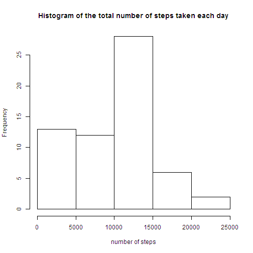
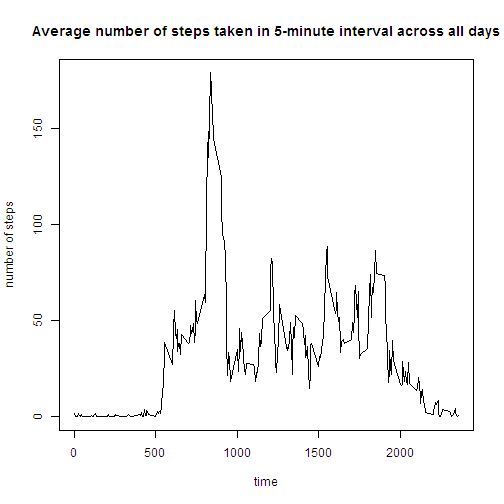
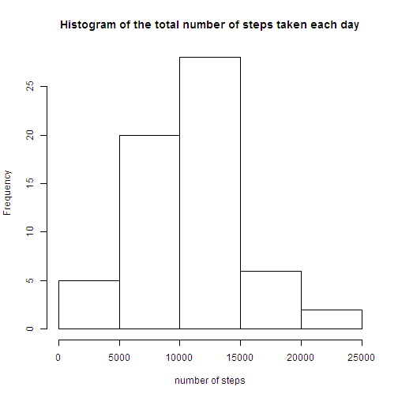
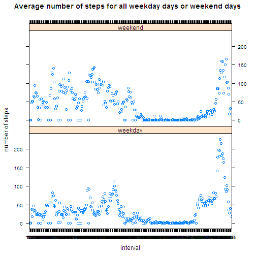

# Reproducible Research: Peer Assessment 1

## Loading and preprocessing the data
At first, we load the data of personal activity

```r
activity <- read.csv("activity.csv")
```


## What is mean total number of steps taken per day?
For the analysis, we calculate the number of steps taken per day.

```r
step_sum <- tapply(activity$steps, activity$date, sum, na.rm = TRUE, simplify = TRUE)
```


Then, we make a histogram of the total number of steps taken each day.

```r
hist(step_sum, xlab = "number of steps", main = "Histogram of the total number of steps taken each day")
```

 


We also calculate the mean and median total number of steps taken per day.

```r
mean(step_sum)
```

```
## [1] 9354
```

```r
median(step_sum)
```

```
## [1] 10395
```

The mean and median total number of steps taken per day are 9354.2295 and 10395.

## What is the average daily activity pattern?
First of all, we calculate the average number of of steps taken in each 5-minute interval across all days.

```r
activity$interval <- as.factor(activity$interval)
step_average <- tapply(activity$steps, activity$interval, sum, na.rm = TRUE, 
    simplify = TRUE)/length(levels(activity$date))
```


Then, we make a time series plot of the average number of steps taken.

```r
plot(x = levels(activity$interval), y = step_average, type = "l", xlab = "time", 
    ylab = "number of steps", main = "Average number of steps taken in 5-minute interval across all days")
```

 


We can find the 5-minute interval which contains the maximum number of steps on average across all the days.

```r
names(which.max(step_average))
```

```
## [1] "835"
```

The maximum number of steps on average across all the days is 104 and its corresponding 5-minute interval is 835.

## Imputing missing values
At the beginning, we calculate the total number of missing values in the dataset.

```r
na_number <- sum(!complete.cases(activity$steps))
```

The total number of missing values in the dataset is 2304.

Then we use the mean/median of that 5-minute interval to fill in all of the missing values in the dataset. The original dataset with the missing data is stored in **original_data** and the clean dataset with the missing data filled in is stored in **clean_data**. 

```r
original_data <- activity
for (i in 1:length(activity$steps)) {
    if (is.na(activity$steps[i])) {
        for (j in 1:length(step_average)) {
            if (as.character(activity$interval[i]) == names(step_average[j])) 
                activity$steps[i] = step_average[j]
        }
    }
}
clean_data <- activity
```


After taht, we make a histogram of the total number of steps taken each day for the clean dataset.

```r
clean_step_sum <- tapply(clean_data$steps, clean_data$date, sum, na.rm = TRUE, 
    simplify = TRUE)
hist(clean_step_sum, xlab = "number of steps", main = "Histogram of the total number of steps taken each day")
```

 


We also calculate the mean and median total number of steps taken per day for the clean dataset.

```r
mean(clean_step_sum)
```

```
## [1] 10581
```

```r
median(clean_step_sum)
```

```
## [1] 10395
```

The mean and median total number of steps taken per day are 1.0581 &times; 10<sup>4</sup> and 1.0395 &times; 10<sup>4</sup>. Compared with the estimates from the first part of the assignment, the difference of mean and median value are -1226.7842 and 0. We find that the shape of two histograms change a little, especially for the number of steps below 10000. The median value have no difference from the estimates from the first part of the assignment. However, the mean value increase significantly. Therefore, after imputing missing data, the total daily number of steps increase a little.

## Are there differences in activity patterns between weekdays and weekends?
At first, we create a new factor variable in the dataset with two levels ¨C ¡°weekday¡± and ¡°weekend¡± indicating whether a given date is a weekday or weekend day.

```r
Sys.setlocale("LC_TIME", "en")
```

```
## [1] "English_United States.1252"
```

```r
weekday <- weekdays(as.Date(clean_data$date, "%Y-%m-%d"))
for (i in 1:length(weekday)) {
    if ((weekday[i] == "Saturday") | (weekday[i] == "Sunday")) 
        weekday[i] = "weekend" else weekday[i] = "weekday"
}
clean_data$weekday <- as.factor(weekday)
```


Then we make a panel plot containing a time series plot of the average number of of steps taken in each 5-minute interval across all weekday days or weekend days.

```r
clean_data2 <- split(clean_data, clean_data$weekday)
weekday <- clean_data2$weekday
weekend <- clean_data2$weekend
step_average_weekday <- tapply(weekday$steps, weekday$interval, sum, simplify = TRUE)/(length(weekday$weekday)/288)
step_average_weekend <- tapply(weekend$steps, weekend$interval, sum, simplify = TRUE)/(length(weekend$weekday)/288)
output <- data.frame(steps = c(step_average_weekday, step_average_weekend), 
    interval = c(levels(activity$interval), levels(activity$interval)), weekday = as.factor(c(rep("weekday", 
        length(step_average_weekday)), rep("weekend", length(step_average_weekend)))))
library(lattice)
xyplot(steps ~ interval | weekday, data = output, layout = c(1, 2), ylab = "number of steps", 
    main = "Average number of steps for all weekday days or weekend days")
```

 


